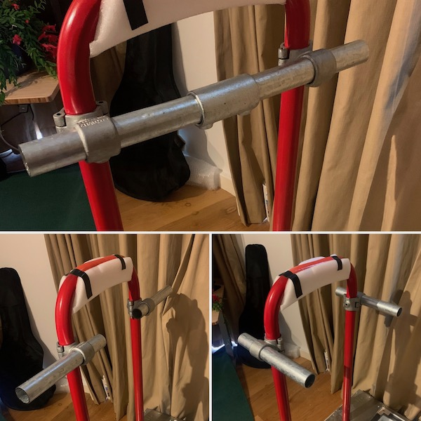
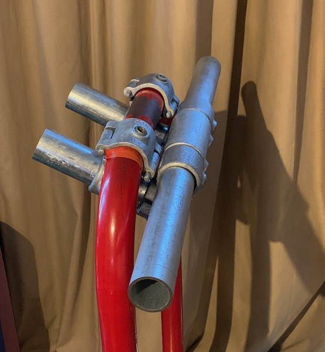
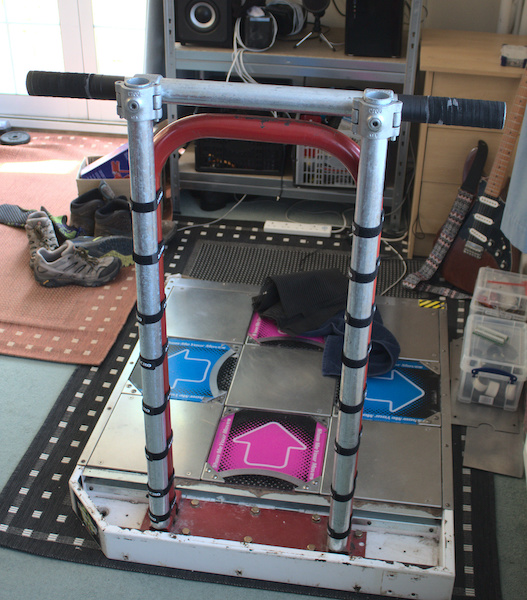
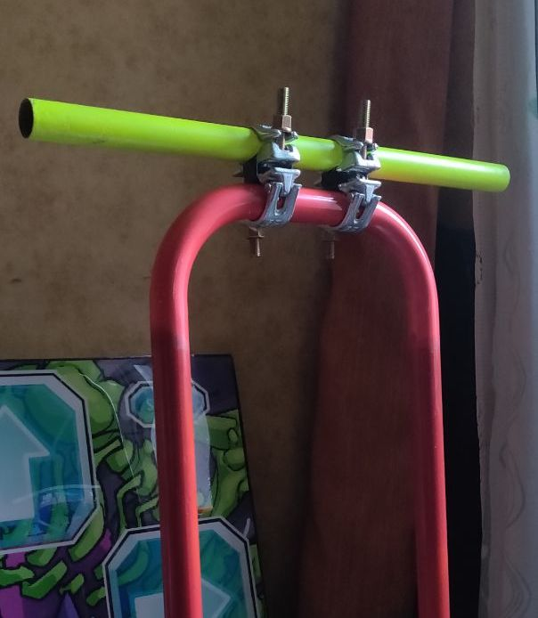
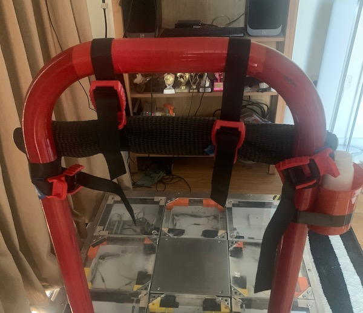

# DDR bar scaffolding mods
DDR bars can be easily modded with scaffolding supplies to achieve the desired height, width, and distance from the center panel.

DDR and ITG bars are 40 mm in diameter, which works with standard 42 mm fittings. If you have an L-Tek, or an SMX, make sure to measure your bar first. Then, head over to a scaffolding supply store ([example](https://www.keyclampstore.com/key-clamp-fittings/42mm-key-clamp)) and find the fittings to build your mod. The same stores will often cut pipes to size, which you'll need for the bar. Below are a few mods for your inspiration.

Some things I learned:
* Ensure the fittings that go on your bar are the clamp-on variety, the ones that can be opened and closed around the pipe. This is because DDR and ITG bars have a plate on the bottom, so you won't be able to put a solid fitting on it. The fittings that go on the additional pipes don't have to open.
* The fittings **will** chip your bar paint.
* The fittings only work on straight parts of the bar. If it is even slightly curved, it will be hard to impossible to move the fitting around that area. Keep this in mind as you design for desired height.

## Mod examples

### Sereni's low two-pipe

Adjustable width or distance. Lower height, limited at 85 cm or lower by the curve of the bar.

Materials: two 25 cm pipes, two [add-on crossovers 137](https://www.keyclampstore.com/add-on-crossover-42mm-137-42-c).

### Sereni's wide adjustable

This mod adjusts to any height and distance via rotation and extension of the back pipes. For example, rotating them to be parallel to the floor would bring the bar up. Using more free length from the back would bring it forward. Use longer pipes for greater range. The clamps on top are at their widest position, limited by the red bar curve.

Materials: two 20 cm pipes, one pipe of your desired bar width, four [add-on crossovers 137](https://www.keyclampstore.com/add-on-crossover-42mm-137-42-c).

### ITGaz's high and wide

This configuration can be adjusted for height as high as the side pipes permit.

Materials: long pipes, a cross pipe of desired width, two add-on crossovers, zip ties.

### atomcat's high and wide

This mod makes a fixed wider and slightly higher bar.

Materials: one pipe, two clamp-on swivel connectors.

### Bonus: not scaffolding

A light and mostly stable bar-lowering mod for all your travel needs. Played on this for a few weeks and even leveled up!

Materials: four heavy duty buckle straps, a massage roller, foam padding.
